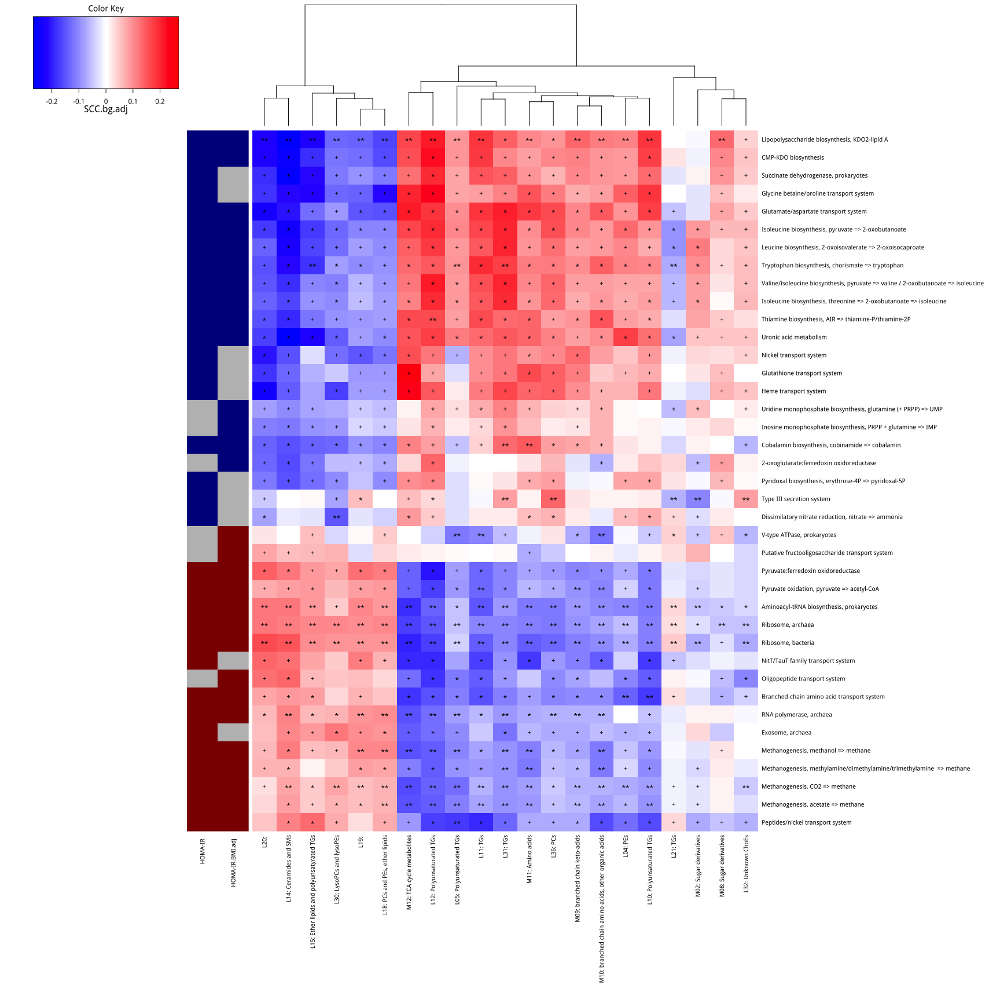

宏基因组、代谢组和表型信息关联分析
================
November 15, 2018

Information
-----------

-   Paper: [A computational framework to integrate high-throughput ‘-omics’ datasets for the identification of potential mechanistic links](https://www.nature.com/articles/s41596-018-0064-z#Sec30)
-   Supplementary information: <https://www.nature.com/articles/s41596-018-0064-z#Sec30>
-   整理成R markdown格式，用测试数据测试

Stage I. starting an R session with all required packages and input file
------------------------------------------------------------------------

-   Input data download from <https://www.nature.com/articles/s41596-018-0064-z#Sec30>;
-   将example\_input.zip解压至Rmd目录下的data文件夹，即可直接运行该Rmd

``` r
source("Rscripts/step2_load.libraries.R")
```

    ## Loading required package: dynamicTreeCut

    ## Loading required package: fastcluster

    ## 
    ## Attaching package: 'fastcluster'

    ## The following object is masked from 'package:stats':
    ## 
    ##     hclust

    ## 

    ## ==========================================================================
    ## *
    ## *  Package WGCNA 1.64.1 loaded.
    ## *
    ## *    Important note: It appears that your system supports multi-threading,
    ## *    but it is not enabled within WGCNA in R. 
    ## *    To allow multi-threading within WGCNA with all available cores, use 
    ## *
    ## *          allowWGCNAThreads()
    ## *
    ## *    within R. Use disableWGCNAThreads() to disable threading if necessary.
    ## *    Alternatively, set the following environment variable on your system:
    ## *
    ## *          ALLOW_WGCNA_THREADS=<number_of_processors>
    ## *
    ## *    for example 
    ## *
    ## *          ALLOW_WGCNA_THREADS=8
    ## *
    ## *    To set the environment variable in linux bash shell, type 
    ## *
    ## *           export ALLOW_WGCNA_THREADS=8
    ## *
    ## *     before running R. Other operating systems or shells will
    ## *     have a similar command to achieve the same aim.
    ## *
    ## ==========================================================================

    ## 
    ## Attaching package: 'WGCNA'

    ## The following object is masked from 'package:stats':
    ## 
    ##     cor

    ## 
    ## Attaching package: 'flashClust'

    ## The following object is masked from 'package:fastcluster':
    ## 
    ##     hclust

    ## The following object is masked from 'package:stats':
    ## 
    ##     hclust

    ## Loading required package: MASS

    ## 
    ## Attaching package: 'gplots'

    ## The following object is masked from 'package:stats':
    ## 
    ##     lowess

    ## Loading required package: ggplot2

    ## 
    ## Attaching package: 'cowplot'

    ## The following object is masked from 'package:ggplot2':
    ## 
    ##     ggsave

``` r
source("Rscripts/step3_import.input.files.R")
source("Rscripts/step4_preprocessing.data.for.sparsity.R")
```

Stage II: co-abundant clustering of metabolome data
---------------------------------------------------

-   WGCNA clustering is performed separately on lipidomic and metabolomic measurements to detect clusters of densely connected metabolites/lipids.

``` r
source("Rscripts/step5_identify.WGCNA.clusters.for.metabolites.R")
```

    ## ..connectivity..
    ## ..matrix multiplication (system BLAS)..
    ## ..normalization..
    ## ..done.
    ##  ..cutHeight not given, setting it to 0.997  ===>  99% of the (truncated) height range in dendro.
    ##  ..done.
    ##  mergeCloseModules: Merging modules whose distance is less than 0.2
    ##    Calculating new MEs...

``` r
dir.create("./results")
source("Rscripts/step6_associate.metabolites.with.phenotype.R")
source("Rscripts/step7a_identify.WGCNA.clusters.for.lipids.R")
```

    ## ..connectivity..
    ## ..matrix multiplication (system BLAS)..
    ## ..normalization..
    ## ..done.
    ##  ..cutHeight not given, setting it to 0.996  ===>  99% of the (truncated) height range in dendro.
    ##  ..done.
    ##  mergeCloseModules: Merging modules whose distance is less than 0.25
    ##    Calculating new MEs...

``` r
source("Rscripts/step7b_associate.lipids.with.phenotype.R")
```

Stage III: phenotype filterin
-----------------------------

-   This analysis stage generates associations between the dimensionality-reduced -omics data and a clinically interesting phenotype

``` r
source("Rscripts/step8_associate.metabolite.clusters.with.phenotype.R")
source("Rscripts/step9_associate.MGSs.with.phenotype.R")
source("Rscripts/step10_associate.KEGG.modules.with.phenotype.R")

source("Rscripts/step11_save.phenotype.associations.R")
source("Rscripts/step12_select.significant.features.R")
```

Stage IV: cross-domain association analyses
-------------------------------------------

-   This stage tests the association of the set of metabolite clusters associated with the phenotype of interest with the set of functional metagenome features likewise so associated.

``` r
source("Rscripts/step13_associate.metabolite.clusters.with.KOs.R")
source("Rscripts/step14_associate.metabolite.clusters.with.KEGG.modules.R")
```

-   Plot metabolome–microbiome functional analysis results (heatmap)

<!-- -->

    ## [1] 39

    ## [1] 21



-   (Optional) Export metabolome–microbiome associations for network analysis, visualizing and analyzing networks in **Cytoscape**

``` r
source("Rscripts/step16_export.edge.node.files.R")
```

Stage V: driver-species analysis
--------------------------------

-   This stage of the analysis allows users to test which bacterial taxa (in the sense of MGS as defined from the metagenomic datasets themselves) are driving the functional effects seen, enabling assessment of the extent to which different taxa explain a functional potential association with a phenotype of interest.

``` r
# <U+8017><U+65F6>,<U+4E4B><U+524D><U+8DD1><U+51FA><U+7ED3><U+679C><U+FF0C>Rmd<U+6682><U+4E0D><U+8FD0><U+884C>
# source('Rscripts/step17_leave.one.MGS.out.analysis.R') # ~1 h
# source('Rscripts/step18_extract.top.driver.species.R') if(
# !('density_plot_SCC_HOMA.IR.pdf' %in% dir('./results/'))){
# source('Rscripts/step19_plot.leave.one.MGS.out.results.R') }
```
